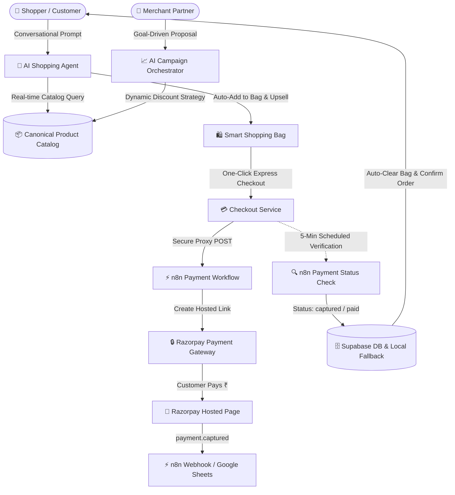

<div align="center">

# ✨ ShopNTrust — AI-Powered Autonomous Commerce Platform

### *Next-Generation Intelligent E-Commerce with Autonomous Agentic Shopping, Real-Time Razorpay & n8n Payment Orchestration, and Merchant Campaign Intelligence.*

<br/>

[](https://nextjs.org/)
[](https://react.dev/)
[](https://www.typescriptlang.org/)
[](https://tailwindcss.com/)
[](https://supabase.com/)
[](https://razorpay.com/)
[](https://n8n.io/)

<br/>

[🌟 Explore Live Demo](http://localhost:3000) • [🛍️ Marketplace Catalog](http://localhost:3000/shop) • [🤖 AI Shopping Assistant](http://localhost:3000/ai-shop) • [📊 Merchant Dashboard](http://localhost:3000/merchant)

</div>

---

## 📖 Overview

**ShopNTrust** is an enterprise-grade, agentic e-commerce platform built for the **Razorpay Buildathon**. It bridges the gap between conversational AI intelligence, dynamic merchant inventory management, and automated payment flows.

By integrating **Next.js 16 (Turbopack)**, **Google Gemini-powered AI Agents**, **n8n Automation Workflows**, and **Razorpay Payments**, ShopNTrust provides an autonomous shopping experience where AI doesn't just recommend products—it actively orchestrates checkout, tracks order reconciliation, and optimizes merchant revenue.

---

## 🚀 Key Highlights & Architecture



---

## 🌟 Core Features

### 🛍️ 1. Autonomous AI Shopping Assistant (`/ai-shop`)
- **Conversational Product Discovery:** Natural language understanding powered by Google Gemini and n8n workflows.
- **Context-Aware Recommendations:** Automatically recommends matching accessories, upsells, and cross-sells.
- **Direct Cart Operations:** AI can directly add items, adjust quantities, and initiate express checkout for the user.

### 💳 2. Authoritative Razorpay & n8n Payment Flow
- **Server-to-Server Payment Link Generation:** Clean proxy API (`/api/payment/create-link`) prevents secret leaks and CORS issues.
- **Product Attribution & Notes:** Passes itemized `Product Name`, `Quantity`, `Product ID`, and `Order ID` into Razorpay Payment Notes.
- **5-Minute Automated Payment Status Check:** Background scheduler verifies payment capture with n8n after 5 minutes, ensuring zero missing confirmations even on tab drops.
- **Instant Order Reconciliation:** Automatic transition from `Pending` to `Paid` (`200 OK`) and automatic bag clearance upon payment capture.

### 📊 3. Merchant Intelligence & AI Campaign Orchestrator (`/merchant`)
- **Goal-Driven Campaigns:** Merchants describe business goals (e.g., *"Clear excess iPhone inventory before Diwali"*), and AI generates structured discount proposals.
- **Real-Time Revenue Analytics:** Track AI-attributed GMV, conversion rates, and campaign ROI with interactive charts.
- **Dynamic Catalog Pricing:** Activated campaigns automatically reflect across the storefront with special promotional badges.

### 🛡️ 4. Enterprise-Grade Security & Data Integrity
- **Dual-Tier Persistence:** Cloud database via **Supabase PostgreSQL** with instant local JSON fallback resilience.
- **Customer Isolation & Auth Guards:** Complete role-based access control protecting customer order history and merchant admin panels.
- **Deterministic AI Attribution:** Every order tracks whether it was generated through manual search, AI primary recommendations, or AI cross-sells.

---

## 🛠️ Technology Stack

| Layer | Technologies |
| :--- | :--- |
| **Frontend Framework** | [Next.js 16.3.4](https://nextjs.org/) (App Router, Turbopack) |
| **UI & Styling** | [React 19](https://react.dev/), [Tailwind CSS v4](https://tailwindcss.com/), [Framer Motion](https://www.framer.com/motion/) |
| **Icons & Design Tokens** | [Lucide React](https://lucide.dev/), Tailwind Variants |
| **Backend & APIs** | Next.js Server Components, API Route Handlers |
| **Database & Auth** | [Supabase](https://supabase.com/) (PostgreSQL, Row-Level Security, Supabase Auth) |
| **Payments** | [Razorpay](https://razorpay.com/) Payment Links & Webhooks |
| **Workflow Automation** | [n8n](https://n8n.io/) Cloud (AI Agent, Order Creation, Payment Status Check) |
| **AI Models** | Google Gemini 2.0 via n8n integration layer |

---

## 📂 Project Structure

```text
ShopNTrust/
├── shopntrust/
│   ├── src/
│   │   ├── app/
│   │   │   ├── (storefront)/        # Storefront pages (Home, Shop, Product Details)
│   │   │   ├── ai-shop/             # Conversational AI Shopping Interface
│   │   │   ├── cart/                # Shopping Bag with real-time price totals
│   │   │   ├── checkout/            # Express Checkout with Razorpay integration
│   │   │   ├── payment/             # Success & Failure reconciliation handlers
│   │   │   ├── orders/              # Customer Order History & Tracking
│   │   │   ├── merchant/            # Merchant Dashboard & Campaign Studio
│   │   │   └── api/                 # Secure Backend API Route Handlers
│   │   │       ├── agent/           # Proxy to n8n AI Shopping Agent
│   │   │       ├── campaigns/       # AI Campaign generation & activation
│   │   │       ├── orders/          # Order creation, fetching, and updates
│   │   │       └── payment/         # Payment link creation, webhook & status check
│   │   ├── components/              # Modular UI Components (Navbar, Cards, Modals)
│   │   ├── lib/                     # Core Business Logic (Catalog, Auth, Supabase)
│   │   ├── store/                   # React Context Providers (Cart, Auth, Campaigns)
│   │   └── types/                   # Strongly-typed TypeScript interfaces
│   ├── supabase/                    # SQL Database Schemas, RLS Policies & Migrations
│   ├── scripts/                     # Asset mapping, catalog parsers & integrity auditors
│   ├── public/                      # Static assets, logos, and high-res product images
│   └── package.json                 # Project dependencies and npm scripts
└── README.md                        # Project documentation
```

---

## 🚦 Getting Started

### 1. Prerequisites
- **Node.js** `v20.x` or higher
- **npm** or **yarn** / **pnpm**
- **Supabase Account** & **Razorpay Test Account**

### 2. Clone the Repository
```bash
git clone https://github.com/AashishSahu05/ShopNTrust.git
cd ShopNTrust/shopntrust
```

### 3. Install Dependencies
```bash
npm install
```

### 4. Configure Environment Variables
Create a `.env.local` file in the `shopntrust/` directory:

```env
# n8n Automation Endpoints
NEXT_PUBLIC_N8N_AGENT_WEBHOOK_URL=https://shopntrust.app.n8n.cloud/webhook/...
NEXT_PUBLIC_N8N_PAYMENT_WEBHOOK_URL=https://shopntrust.app.n8n.cloud/webhook/...
NEXT_PUBLIC_N8N_PAYMENT_STATUS_CHECK_URL=https://shopntrust.app.n8n.cloud/webhook/708c49a9-8acd-4cbf-9bdd-81dcf61830f8
NEXT_PUBLIC_N8N_CAMPAIGN_WEBHOOK_URL=https://shopntrust.app.n8n.cloud/webhook/...

# Supabase Configuration
NEXT_PUBLIC_SUPABASE_URL=https://<your-project>.supabase.co
NEXT_PUBLIC_SUPABASE_ANON_KEY=your-anon-key
SUPABASE_SERVICE_ROLE_KEY=your-service-role-key
```

### 5. Run the Local Development Server
```bash
npm run dev
```

Open **[http://localhost:3000](http://localhost:3000)** in your browser.

---

## 🧪 Testing & Verification

### Build & Typecheck
```bash
npm run build
```

### Key URLs for Evaluation
- **Homepage:** `http://localhost:3000`
- **Shop Catalog:** `http://localhost:3000/shop`
- **AI Shopping Assistant:** `http://localhost:3000/ai-shop`
- **Merchant Studio:** `http://localhost:3000/merchant`
- **Order History:** `http://localhost:3000/orders`

---

## 🏆 Razorpay Buildathon Submission

Built with ❤️ for the **Razorpay Buildathon** by **[Aashish Sahu](https://github.com/AashishSahu05)**.

*Empowering next-generation commerce with autonomous AI agents and seamless payments.*
